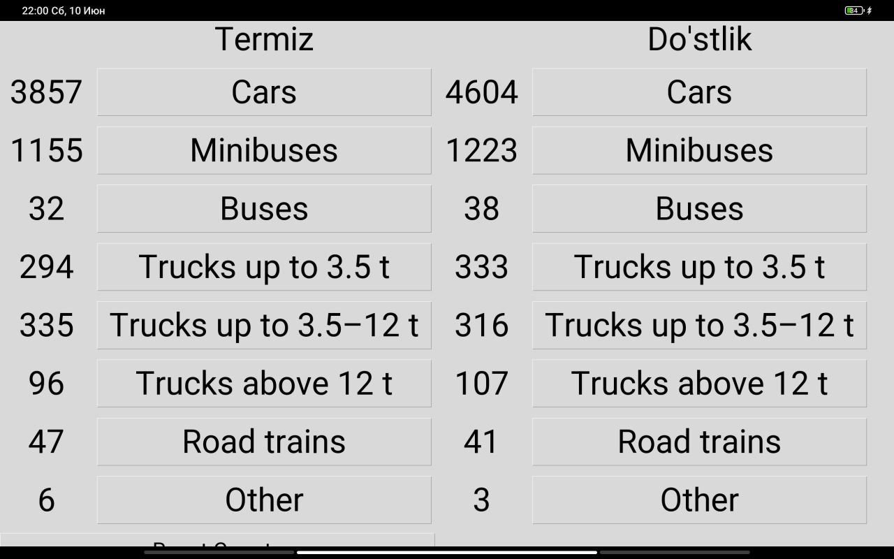

# Traffic Count App

The Traffic Count App is a simple application that allows users to count and track the number of vehicles passing in different directions. It provides a user-friendly interface with buttons for each vehicle type and direction.

## Features

- Count and track the number of vehicles in different directions.
- Save the count data to a CSV file for further analysis.
- Reset the counts to start a new count session.

## Prerequisites

- Python 3.x
- Tkinter library (usually comes pre-installed with Python)

## Usage

1. Clone the repository or download the source code files.
2. Install the required dependencies by running the following command:
pip install -r requirements.txt

3. Run the application by executing the `Traffic_count.py` file:

4. The application window will open, displaying two sections for counting vehicles in "Direction A" and "Direction B".
5. Click on the respective buttons to increment the count for each vehicle type and direction.
6. The counts will be displayed on the screen, and the data will be saved to a CSV file named "traffic_data.csv" in the same directory.
7. To reset the counts and start a new count session, click the "Reset Counts" button.

## App Screenshot

## License

This project is licensed under the [MIT License](LICENSE).

